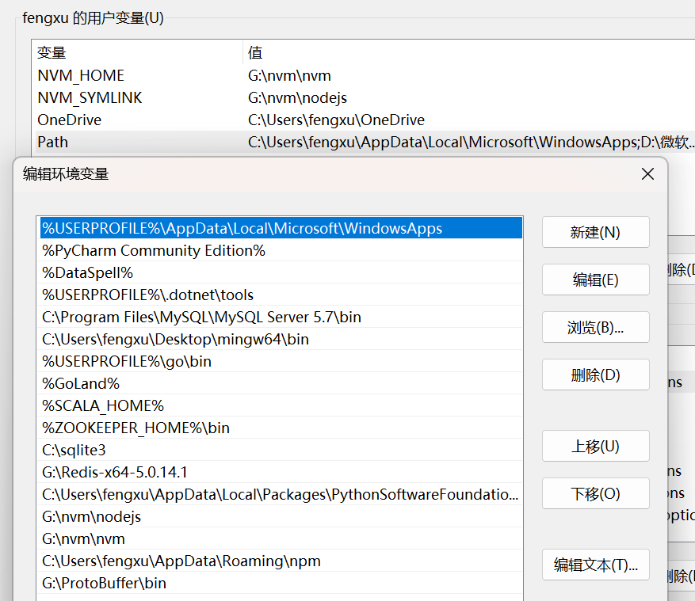

# Rpc入门教学(一) ———— RPC介绍与protobuf的介绍与使用

## 什么是RPC
RPC（Remote Procedure Call，远程过程调用）是一种允许程序调用另一台计算机上的子程序或函数的协议，而无需程序员显式地进
行底层网络编程。RPC的目标是让开发者在编写分布式应用时，可以像调用本地函数一样简单地调用远程服务，隐藏了网络通信的复杂性。

## RPC与TCP协议以及HTTP协议的区别

1. RPC与HTTP的区别
- `目的`：HTTP（HyperText Transfer Protocol，超文本传输协议）主要是为了在网络上交换超文本而设计的一种应用层协议，通常用于浏览器和服务器之间的数据传输。它是一个无状态的、基于请求/响应模式的协议。而RPC是为了简化跨不同地址空间的程序间通信，其设计目标是透明化远程服务调用。
- `语义`：HTTP有明确的动词（如GET, POST, PUT, DELETE等），表示对资源的操作；RPC则更侧重于过程或方法调用，语义上更像是面向对象或过程式的编程语言中的函数调用。
- `格式`：HTTP消息一般以明文形式发送，并且有固定的格式，包括头部和主体；RPC的消息格式依赖于具体的实现，可能是二进制或者某种序列化后的文本格式，比如JSON、XML或Protocol Buffers等。

2. RPC与TCP的区别
- `层次`：TCP（Transmission Control Protocol，传输控制协议）位于OSI模型的传输层，提供了一个可靠的、面向连接的数据流传输服务。它是很多更高层次协议的基础，包括HTTP和某些RPC实现。RPC通常会使用TCP作为其底层传输协议之一，但RPC也可以构建在UDP等其他传输层协议之上。
- `抽象级别`：TCP提供了字节流级别的接口给上层应用，应用程序需要自己处理如何组织这些字节流成有意义的信息单元。相比之下，RPC为开发者提供了一个更高的抽象级别，使得远程服务调用看起来像是本地的方法调用，隐藏了许多底层细节，如网络连接管理和数据序列化。

3. 总结
tcp是传输层。它提供了一种可靠的数据传输机制，确保数据包能够无误地从一个端点传输到另一个端点。它是构建更高层次协议的基础，而RPC和HTTP都是应用层协议，它们在TCP之上构建，提供更高层次的抽象和功能。HTTP主要用于Web浏览器和服务器之间的信息交换，而RPC则用于实现程序间的远程方法调用。
HTTP定义了如何在网络上传输网页内容的标准，适用于广泛的Web应用场景，并且具有良好的浏览器兼容性和简易性。 RPC的目标是让开发者更容易编写分布式应用程序，它试图隐藏网络通信的复杂性，使远程服务调用尽可能接近本地函数调用的体验。

## grpc的介绍
gRPC（Google Remote Procedure Call）是Google开发的一个高性能、开源和通用的远程过程调用（RPC）框架。它旨在使客户端能够像调用本地对象一样轻松地调用不同服务器上的远程服务，从而简化分布式应用和服务的构建。

它有以下特点:
- `基于HTTP/2`：gRPC默认使用HTTP/2作为传输协议，这使得它能够利用HTTP/2的所有特性，如多路复用、头部压缩等，提高了通信效率和性能。
- `Protocol Buffers`：gRPC默认采用Google的Protocol Buffers（Protobuf）作为接口定义语言（IDL）和底层的消息交换格式。Protobuf是一种高效的二进制序列化协议，支持多种编程语言，并且可以自动生成客户端和服务端的存根代码。
- `双向流式传输`：除了简单的请求-响应模式外，gRPC还支持四种通信模式：简单RPC（Unary RPC）、服务端流式RPC、客户端流式RPC以及双向流式RPC。这为开发者提供了更多的灵活性来设计他们的服务交互模型。
- - `跨平台`：gRPC支持多种编程语言，包括C++、Java、Python、Go、C#、Dart等，使得开发者可以在不同平台和语言中构建分布式应用。

## Protobuf

### protobuf介绍
Protocol Buffers（简称Protobuf）是Google开发的一种语言中立、平台无关、可扩展的序列化结构数据格式，主要用于通信协议、
数据存储等。它允许你定义一次数据结构，然后可以使用生成的代码在多种编程语言中轻松地将这些结构序列化为紧凑的二进制格式或反
序列化回来。

### protobuf的优点

1. `高效性`：相比于JSON或XML，Protobuf提供了更紧凑的数据表示形式和更快的解析速度。这使得它非常适合于需要高效传输大量数据的应用场景，如移动应用和微服务之间的通信。
2. `语言和平台无关`：Protobuf支持多种编程语言（如C++、Java、Python、Go、Ruby、C#、JavaScript等），并且可以在不同操作系统上运行。这意味着你可以用不同的语言编写客户端和服务端代码，而无需担心兼容性问题。
3. `版本控制`：Protobuf设计时考虑到了向后兼容性，因此即使你的消息格式发生变化，旧版代码仍然可以读取新版消息，只要新增字段有合理的默认值。这种灵活性对于长期演进的项目非常有用。
4. `自动生成代码`：通过定义.proto文件中的消息格式，你可以利用protoc编译器来自动生成所需语言的类或结构体，减少了手动编码的工作量并降低了出错的可能性。
5. `强大的类型系统`：Protobuf具有丰富的基本类型，并且支持嵌套的消息、枚举类型以及重复字段（即数组）。此外，还可以定义服务接口，这对于RPC框架（如gRPC）特别重要。

### protobuf的安装与使用

#### Windows下安装protobuf编译器
我们首先可以到[protobuf官网](https://github.com/protocolbuffers/protobuf/releases)下载对应的安装包，然后解压到任意位置，然后将bin目录加入到环境变量中。
重启电脑就可以了像下面这样:

重启电脑之后可以像下面一样查看一下是否安装成功:


### protobuf的使用

在讲解protobuf的使用之前，我们先要配置protoc-gen-gom,具体可以参考下面这个链接
[protoc-gen-gom](https://blog.csdn.net/qq_37102984/article/details/143026783)
在安装完完protoc-gen-gom之后，我们就可以创建一个简单的案例了，首先我们创建一个user.proto文件，然后编写对应的代码像下面这样:
```protobuf
syntax = "proto3";  // 指定proto版本

// option go_package = "path;name";  // 指定生成的go文件路径和包名
option go_package = "../services";

package pbfile;  // 指定包名

message User {
  string name = 1;
  string email = 2;
  string phone = 3;
}
```

最后我们执行下面命令就可以生成对应的go文件了:
```bash
protoc --go_out=./  .\user.proto
```
最后我们就可以进行数据类型的序列化与反序列化了，代码如下:
```go
/*
@author: fengxu
@since: 2024-12-23
@desc: //TODO
*/
package main

import (
	"fmt"
	"github.com/golang/protobuf/proto"
	"gopher/src/grpc/grpc1/services"
)

func main() {
	user := &services.User{
		Name:  "fengxu",
		Email: "fengxu@gmail.com",
		Phone: "123456789",
	}

	//序列化
	newUser := &services.User{}
	marshal, err := proto.Marshal(user)
	if err != nil {
		panic(err)
	}

	//反序列化
	err = proto.Unmarshal(marshal, newUser)
	if err != nil {
		panic(err)
	}

	fmt.Println(newUser)
}
```

## proto文件的编写

```protobuf
syntax = "proto3";  // 指定protobuf版本
package pbfile; // 包名
option go_package = "./services"; // 指定生成go代码的路径

message User{   //我们通过message关键字定义一个消息类型，注意消息字段定义是会要求填写标示值
  string name=1;
  optional string email=2; //optional表示该字段不是必须的,可以不填
  repeated string phone=3; //repeated表示该字段可以重复,如果重复了,那么返回的数组长度就是重复的次数
}

message UserList{  //message支持嵌套
  repeated User user=1;
  message college{
    string name=1;
  }
}

service UserService{  //我们也可以用service定义一个服务
  rpc GetUser(User) returns (User); //rpc定义一个rpc方法,参数是User类型,返回值也是User类型
}
```